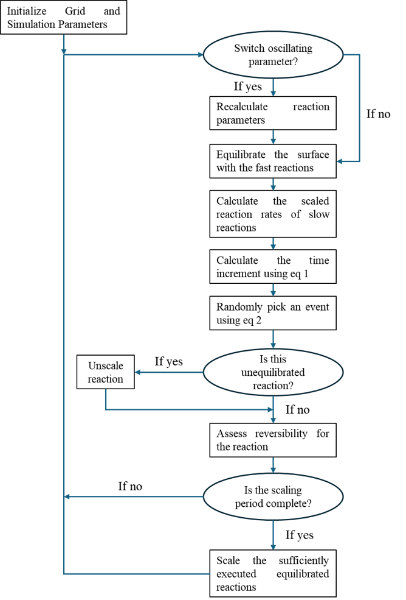

# CPEC_AmmoniaSynthesis
This repository is for the relevant files for performing and visualizing kinetic monte carlo simulations (kMC) presented in the paper, "Kinetic study of Ammonia synthesis on Ru (0001) using dynamic surface charge oscillations through programmable catalysis". While the provided input files run kMC simulations specifically for NH3 synthesis on Ru(0001) surface, the input files can be approapriately modified to extend it to different surface chemistries on different metals and different facets lying within the scope of the program.

# Software Version used:
1) gcc version: 4.4.7
2) mpiexec compiler version: 1.6.2

# Algorithmic Details of the kMC code:
The schematic flowchart of the accelerated kMC algorithm is shown in the figure below:

The step by step outline of the kMC algorithm is as follows:
1) Generate an initial surface configuration ($\delta$) (t = 0) and initialize the kinetic and interaction parameters.
2) Check if the oscillation parameter needs to be changed or not. If it is to be changed, update the kinetic parameters.
3) Equilibrate the surface with the fast elementary steps set by the user using the Donghai approach and update the surface configuration ($\gamma$).
4) Determine the reaction rate $r_{γβ}$ for all the slow elementary steps taking surface configuration from $\gamma$ to a surface configuration $\beta$ and calculate the total reaction rate as  
$r_{tot(\gamma)}=\sum_{\beta} r_{\gamma\beta}$ 
5) Select the elementary step i taking the surface configuration from $\gamma \to \gamma'$ such that the following inequality holds  
$\sum_{\beta < \gamma'-1} r_{\gamma\beta} < \rho_1 \times r_{tot(\gamma)} \leq \sum_{\beta < \gamma'} r_{\gamma\beta}$  
where $\rho_1$ is a randomly generated number form a uniform distribution in the interval [0,1]
6) Advance the time using a second random number using the equation below  
$t=t-\frac{ln\rho_2}{r_{tot(\gamma)}}$  
where $\rho_2$ is a randomly generated number from a uniform distribution in the interval [0,1]
7) Calculate the equilibration ratio ($e$) of the selected step using equation below. If the ratio is within the tolerance specified by the user, mark the step as equilibrated.  
$e=\frac{N_f-N_b}{N_f}$  
where $N_f$ and $N_b$ is the number of forwrad and backward steps respectively recorded in the current superbasin
8) If the selected step is equilibrated and has been executed more than the user specified frequency in the current superbasin, rescale the preexponential factor of both forward and reverse step using the scaling factor (α) calculated as  
$\alpha = \frac{r_{max.avg}}{(\frac{r_{f,i}+r_{b,i}}{2})}$  
where $r_{max,avg}$ is the maximum rate among unequilibrated steps averaged over time in the current superbasin, $r_{f,i}$ is the averaged rate over time of the forward selected step and $r_{b,i}$ is the averaged rate over time of the backward selected step. The time-averaged rate of the elementary step i ($r_i$) is calculated using:  
$r_i= \frac{1}{\Delta t_s} \sum_{j} r_{i,j} \Delta t_j$  
where $\Delta t_s$ is the time spent in the superbasin, $\Delta t_j$ is the time step of each kMC step j and $r_{i,j}$ is the rate of elementary step $i$ at kMC step j.
9) If the selected step is an unequilibrated step, rescale the scaling factor ($\alpha$) of all the slow steps specified by the user to 1.
10) Update the system configuration from $\gamma$ to $\gamma$' and go to step 2. 

# Instructions for creating an input file

# Instructions for running the kMC simulation

# Instructions for generating snapshots and creating simulation movies
